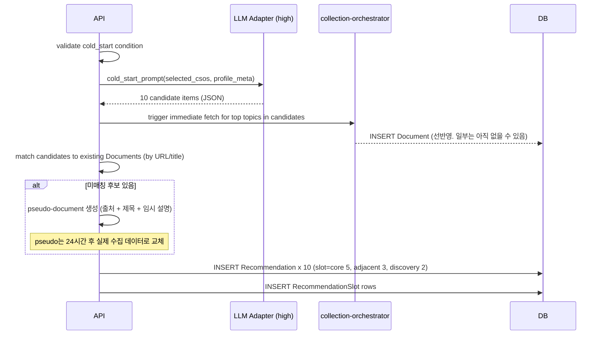

# 알고리즘: Cold-start (LLM 직접 추천 생성)

본 파일은 신규 사용자의 첫 대시보드를 LLM이 직접 생성하는 방식을 정의한다. UC-01 마지막 단계에서 호출된다. 일반 추천 룰은 [`recommendation-ranking.md`](recommendation-ranking.md).

## 적용 조건

- UserInterestState에 양수 신호가 0이면 cold-start
- 또는 마지막 활동이 60 active days 이상 (재활성화 — `cso-topic-traversal.md §5` active day 정의)

## 입력

| 항목 | 출처 |
|---|---|
| 선택 CSO 클러스터 | UC-01 step 4 (최소 1개) |
| 가입 메타 | User.created_at, **사용자 클래스 (학생/연구자/교수/general)** — onboarding API 요청 바디의 transient input으로만 받음. User 테이블에 영구 저장 안 함 (decision-backlog.md P1-1). cold-start LLM 호출 1회의 prompt 입력으로만 사용 |
| 동의 상태 | UserConsent (필수: active) |

## 처리 흐름



## LLM 프롬프트 (model_slot="high")

System:

```
당신은 CS/AI 기술 동향 큐레이션 어시스턴트다. 사용자가 선택한 CSO 12 클러스터 중 1개 이상과 사용자 프로파일 메타를 보고, 그 사용자가 첫 대시보드에서 보면 가장 도움이 될 CS/AI 분야의 대표적이고 신뢰도 높은 최근 기술 동향 10개를 추천하라. 결과는 JSON 배열로만 응답한다. 1차 출처(학술 논문, 빅테크 공식 블로그, 공식 컨퍼런스)를 우선시하고 가짜 정보를 만들지 말 것 — 실제로 존재하는 자료만 추천한다.
```

User:

```
[사용자 프로필]
- 사용자 클래스: {undergraduate|researcher|professor|general}  // 미상이면 general
- 가입 시각: {iso8601}
- 선택한 CSO 클러스터: [{cluster_label_en}, ...]

[지시]
- 정확히 10개 후보
- 슬롯 분배: core 5 (선택 클러스터 직접 관련), adjacent 3 (인접 분야), discovery 2 (잠재적 흥미)
- 각 후보 형식:
  {
    "slot_type": "core" | "adjacent" | "discovery",
    "title": "기사/논문 제목 (영문 원문 우선)",
    "title_ko": "한국어 의역 1줄",
    "source_name": "arXiv | Google Research | OpenAI | DeepMind | TechCrunch | ...",
    "source_type": "academic" | "vendor_blog" | "tech_news",
    "url_hint": "정확한 URL을 모른다면 null. 추측 금지.",
    "doi_hint": "DOI를 알면 명시. 모르면 null.",
    "published_year": 2024 | 2025 | 2026 | null,
    "related_csos_en": ["Computer Vision", "Reinforcement Learning"],
    "reason_short_ko": "한국어 한 문장 추천 이유 (60자 이내). 점수나 알고리즘 언급 금지."
  }
- 가짜 URL/DOI/제목을 만들지 마라. 모르면 null로 둬라.
- 한국어 사용자에게도 영어 원문 자료 추천이 자연스럽다. 단, reason_short_ko는 반드시 한국어.
- 동일 source가 한 슬롯에서 2개 이상 나오지 않도록.
```

## 응답 검증

```python
def validate_cold_start(items: list[dict]) -> list[ColdStartCard]:
    if len(items) != 10:
        raise InvalidColdStartCount(len(items))
    counts = Counter(i["slot_type"] for i in items)
    if counts != {"core": 5, "adjacent": 3, "discovery": 2}:
        raise InvalidSlotDistribution(counts)
    out = []
    for it in items:
        # 영문 제목 + 한국어 의역
        if not it["title"]:
            raise MissingTitle()
        if it["url_hint"] and not validators.url(it["url_hint"]):
            it["url_hint"] = None
        if len(it["reason_short_ko"]) > 80:
            raise ReasonTooLong()
        out.append(ColdStartCard(**it))
    return out
```

## 후처리: pseudo-document → 실제 매칭

LLM 응답의 `url_hint`가 있으면 Document 테이블에서 `canonical_url` 또는 `url` 매칭 시도. 매칭 실패 시:

1. **즉시 수집 트리거** — **(v13 라운드, 2026-05-11)** `collection-orchestrator` 가 `LLMProvider.search_with_tools(trace_json, leaf_label)` 호출로 24시간 내 실 Document 채움. v1~v12 의 source 어댑터 단발성 fetch 패턴은 [`decisions.md §10`](../decisions.md) 으로 폐기.
2. **pseudo Document 행 INSERT** — `content_type="pseudo_cold_start"`, **`source_id` = `Source.name == SentinelSource.COLD_START_PSEUDO_NAME` 시드 행의 UUID** (부팅 시 캐시; contracts.py §6) (24시간 TTL).
   - **(v13 라운드)** Source 테이블 sentinel 2행 운영: ① `cold_start_pseudo` (A2 alembic 0001 시드, 본 항목용) ② `llm_search` (A4 alembic 0003 시드, 일반 LLM 검색 결과 통일 source).
   - sentinel Source는 시스템 부팅 시 시드 데이터로 1행 INSERT: `Source(name="cold_start_pseudo", source_type="vendor_blog", url="internal://cold-start-pseudo", trust_level="low", enabled=false)`. enabled=false라 일반 수집 잡에서는 호출되지 않음. cold-start pseudo Document만 이 source_id를 FK로 참조하여 `Document.source_id NOT NULL + RESTRICT` FK 충족.
   - 실제 데이터 수집으로 원본 Document가 INSERT되면 LLM이 url_hint·title 매칭으로 pseudo와 동일 논문 식별 → pseudo Document 행을 원본으로 merge (DocumentTopic·Recommendation의 document_id를 원본으로 갱신, pseudo는 DELETE).
3. 추천 카드에는 LLM의 `title_ko`를 표시하고, 클릭 시 외부 검색 페이지로 fallback ("Google Scholar에서 찾아보기" 링크). pseudo Document 클릭은 외부 link로만, 문서 상세 화면은 진입 X (또는 "수집 진행 중" 안내).

## 후속 일반 추천과의 transition

- 사용자가 cold-start 카드 중 하나라도 클릭/저장하면, 베이지안 사후가 prior에서 벗어남 → 다음 대시보드는 일반 경로(`recommendation-ranking.md`).
- **첫 클릭 시점에 `UserCSOTraversal` trace 생성**: 클릭한 카드의 Document → DocumentTopic → cso_topic_id 추출 → 그 cso_topic_id를 root로 하는 새 trace (path=[cso_topic_id], status=active) 생성 ([`cso-topic-traversal.md §7.1`](cso-topic-traversal.md))
- **7 active days**가 지나도 cold-start 상태가 유지되면 (사용자가 어떤 신호도 안 줌): 다시 cold-start LLM 호출. 단 max 3회까지. 그 이후는 trust_level=high trend로 fallback.

## 비용 가드

| 항목 | 설정 |
|---|---|
| 사용자당 cold-start LLM 호출 횟수 | 최대 3회 |
| 24시간 동안 전체 cold-start LLM 호출 캡 | <!-- TODO: 운영 부하에 따라 조정. 초기 100/일 --> |
| 응답 시간 SLA | < 8초 (NFR-12 dashboard p95 3초는 캐시 hit 기준이며, cold-start은 그보다 길 수 있음. 클라이언트 폴링 OK) |

응답이 8초 초과 시 API는 `202 + cold_start_in_progress` 반환, 클라이언트는 1초 간격 폴링.
