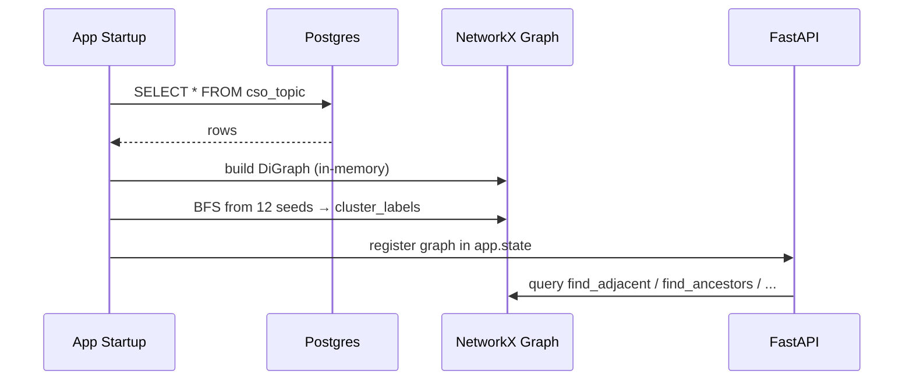

# 알고리즘: CSO 그래프 매핑

본 파일은 NetworkX 메모리 캐시 위에서 CSO 토픽 그래프를 다루는 알고리즘을 정의한다. 인접 토픽 탐색, 상위·후손, 동등 토픽, CSO 12 클러스터 매핑 룰을 다룬다. 관련 FR: FR-09, FR-13, FR-14, FR-16, FR-46, FR-47, FR-48. 관련 API: [`../api/topics.md`](../api/topics.md). CSO 임포트 워크플로는 [`../data/cso-import.md`](../data/cso-import.md).

## CSO 그래프 구조

CSO Computer Science Ontology (https://cso.kmi.open.ac.uk/) 는 다음 관계를 갖는 RDF 그래프이다.

| relation | 의미 |
|---|---|
| `superTopicOf` / `subTopicOf` | 상위/하위 |
| `relatedEquivalent` | 동등 (동의어 또는 매우 가까운 변형) |
| `preferentialEquivalent` | 정규 라벨 |
| `contributesTo` | 약한 인접 (사용 안 할 수도 있음. 1차는 superTopicOf만) |

본 시스템은 `networkx.DiGraph`로 다음 노드와 엣지를 관리.

- **Node**: cso_topic_id (UUID). attributes = {label, uri, parent_topic_id, cluster_label}
- **Edge type**:
  - `parent` — `subTopicOf` (자식 → 부모)
  - `equiv` — `relatedEquivalent` 양방향

## 12 클러스터 매핑

CSO에는 명시적 12개 cluster 메타데이터가 없으므로, 우리는 다음 12개 상위 토픽을 클러스터 루트로 정의하고 import 시 모든 후손을 해당 cluster로 라벨링한다.

| cluster_label | CSO seed topic (label) | 한국어 표시 |
|---|---|---|
| AI | "Artificial Intelligence" | 인공지능 |
| Systems | "Operating Systems" | 시스템 |
| Hardware | "Computer Hardware" | 하드웨어 |
| Theory | "Automata Theory" | 이론 |
| SE | "Software Engineering" | 소프트웨어공학 |
| Networks | "Computer Networks" | 네트워크 |
| IS·DB | "Information Systems" | 정보 시스템 / DB |
| IR | "Information Retrieval" | 정보 검색 |
| Security | "Computer Security" | 보안 |
| HCI | "Human-Computer Interaction" | HCI |
| Graphics·Multimedia | "Interactive Computer Graphics" + "Multimedia Systems" | 그래픽스·멀티미디어 |
| Computational Science | "Scientific Computing" | 계산과학 |

import 시 BFS로 후손을 cluster_label로 라벨링. 한 토픽이 여러 cluster의 후손이면 라벨 set 유지 (예: `cluster_labels = {"AI", "IR"}`).

> **v13 round 3 R3-C03 fix (2026-05-16)**: CSO 3.4.1 에는 원래 seed 라벨 5종 (`Computer Systems Organization` / `Theory of Computation` / `Computer Graphics` / `Multimedia` / `Computational Science`) 이 존재하지 않아 BFS 시작점 부재 → cluster 라벨 부재. 실제 CSO 3.4.1 에 존재하는 5종 (`Operating Systems` / `Automata Theory` / `Interactive Computer Graphics` / `Multimedia Systems` / `Scientific Computing`) 으로 교체. SOR = `backend/app/config/broad_interests.toml` + `backend/app/topic/mapping.py:SEEDS`. `Hardware` → `Computer Hardware`, `Security and Privacy` → `Computer Security` 도 동시 교체.

## 그래프 탐색 알고리즘

### 1. 인접 토픽 (`find_adjacent`)

```python
def find_adjacent(g: DiGraph, seed_id: UUID, hops: int = 1) -> list[UUID]:
    visited = {seed_id}
    frontier = {seed_id}
    for _ in range(hops):
        next_frontier = set()
        for n in frontier:
            # 부모, 자식, equiv 모두 인접으로 간주
            next_frontier.update(g.predecessors(n))   # children (subTopicOf 엣지가 자식→부모이므로 predecessor=child)
            next_frontier.update(g.successors(n))      # parents
            for nb, edge_data in g[n].items():
                if edge_data.get("type") == "equiv":
                    next_frontier.add(nb)
        next_frontier -= visited
        visited.update(next_frontier)
        frontier = next_frontier
    return list(visited - {seed_id})
```

엣지 방향 주의: import 시 `child --subTopicOf--> parent` 엣지를 그렸다면 `successors(n)`이 부모 방향이고 `predecessors(n)`이 자식 방향. 위 의사 코드는 그 가정에 따른다.

### 2. 상위 토픽 (`find_ancestors`)

```python
def find_ancestors(g: DiGraph, seed_id: UUID) -> list[UUID]:
    return list(nx.descendants(g, seed_id))   # successors 방향이 부모이므로 descendants가 ancestors
```

(엣지 방향 명세에 맞춰 nx.ancestors/descendants 호출 방향을 결정. import 단계에서 일관되게.)

### 3. 후손 토픽 (`find_descendants`)

```python
def find_descendants(g: DiGraph, seed_id: UUID) -> list[UUID]:
    return list(nx.ancestors(g, seed_id))   # 위 방향 정의의 반대
```

### 4. 동등 토픽 (`find_equivalents`)

```python
def find_equivalents(g: DiGraph, seed_id: UUID) -> list[UUID]:
    return [nb for nb, data in g[seed_id].items() if data.get("type") == "equiv"]
```

### 5. 클러스터 매핑 (`map_to_clusters`)

```python
def map_to_clusters(g: DiGraph, topic_id: UUID) -> set[str]:
    return g.nodes[topic_id].get("cluster_labels", set())
```

문서를 12 클러스터로 매핑할 때:

```python
def cluster_for_document(g, doc_topic_ids: list[UUID]) -> Counter[str]:
    counter = Counter()
    for tid in doc_topic_ids:
        for cl in map_to_clusters(g, tid):
            counter[cl] += 1
    return counter
```

## CSO grant 거리 (확장 점수)

추천 adjacent 슬롯에서 사용할 그래프 거리:

```python
def graph_distance(g: DiGraph, a: UUID, b: UUID) -> int | None:
    # undirected 거리 (BFS). 도달 불가 시 None
    return nx.shortest_path_length(g.to_undirected(), a, b) if nx.has_path(g.to_undirected(), a, b) else None
```

거리 1 = 직접 인접, 2 = 같은 부모의 형제, 3 이상은 discovery 슬롯에서 사용.

## 메모리 캐시 라이프사이클



DB가 변경되면 (관리자 콘솔에서 CSO 재임포트) 캐시 reload 필요. 1차 시연용으론 reboot로 충분.

## 임포트 무결성 검증

CSO 임포트 후 다음 체크 통과해야 함 (워크플로는 [`../data/cso-import.md`](../data/cso-import.md)):

- 12 cluster seed가 모두 존재 (라벨 매칭)
- 그래프에 사이클 없음 (`nx.is_directed_acyclic_graph(g)` for parent edges only)
- 다양한 CS 도메인 키워드 샘플(예: "deep learning", "distributed systems") 이 12 클러스터 중 하나에 매핑 가능

## v13 라운드 — Document ↔ cso_topic 매핑 단순화 (2026-05-11)

A4 Topic-driven Pivot ([`../decisions.md §10`](../decisions.md))으로 **Document.title+abstract → cso_topic_id 매핑 알고리즘이 불필요**해짐. 사유:

- 기존 v1~v12 디자인: A4 가 어댑터로 수집한 Document 의 title+abstract 를 LLM 또는 키워드 매칭으로 cso_topic_id 에 매핑 (분류 문제).
- v13 디자인: A4 가 사용자 trace 의 active leaf 라벨을 LLM 검색 query 로 사용. **반환된 Document 는 이미 그 leaf 토픽에 부합** (검색 의도가 query). 따라서:
  - `DocumentTopic.cso_topic_id` = leaf 의 부모 cso_topic (검색 시점에 결정)
  - `DocumentTopic.confidence` = LLM 응답의 self-rated score (default 0.8) 또는 1.0 (검색 의도 일치)
- 매핑 알고리즘 별도 구현 X. `app/collection/orchestrator.py` 가 검색 결과를 DocumentTopic 행으로 직접 변환.
- 12 클러스터 매핑 (§클러스터 매핑) 은 그대로 — Document 가 속한 cso_topic 으로부터 cluster_labels 도출은 동일.
