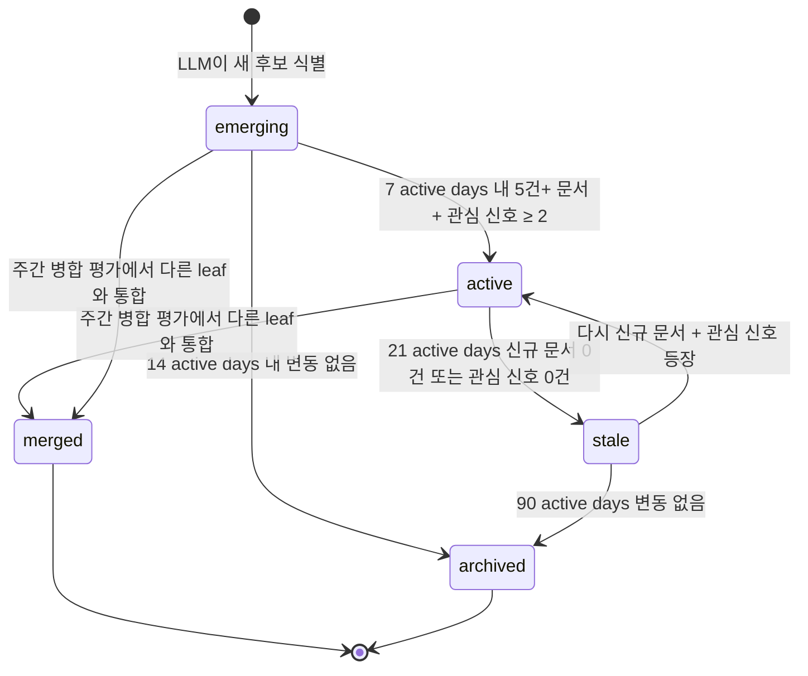

# 알고리즘: 동적 리프 토픽 라이프사이클 (D 하이브리드)

본 파일은 사용자별 동적 리프 토픽의 생성·승격·강등·병합·폐기 알고리즘을 정의한다. SRS Open Issue 3을 해결한다. 관련 FR: FR-14, FR-15, FR-16. `LifecycleEvaluator` 추상은 [`../sdd/module-boundaries.md`](../sdd/module-boundaries.md), 상태 정의는 [`../api/topics.md`](../api/topics.md).

> **Trace 모델과의 관계**: dynamic leaf는 [`cso-topic-traversal.md`](cso-topic-traversal.md)의 `UserCSOTraversal` trace에 종속된 산물이다. leaf의 cso_topic_id 매핑이 어떤 active trace의 path에 포함되어 있을 때만 그 trace에서 참조되며, trace operation(retract/split/archive) 시 LLM이 leaf의 부모 매핑을 재배치한다.

> **Active day 기반**: 본 문서의 모든 N일 임계는 사용자 인터랙션 1+건 있는 active day 단위 ([`cso-topic-traversal.md §5`](cso-topic-traversal.md)). wallclock 잠수 동안 leaf는 stale로 마킹되지 않는다.

## 결정 요약

- **D 하이브리드**: 신규 식별·병합만 LLM, 승격·강등·폐기는 룰 기반.
- **추상화**: `LifecycleEvaluator` 인터페이스로 향후 **B 배치 평가** (모든 평가를 LLM 일괄 호출) 를 갈아끼울 수 있음.
- **주기**: 신규 식별 = 매 일일 수집 직후 (사용자별 LLM 1회/일). 병합 평가 = 주 1회 (사용자별 LLM 1회/주).

## 상태 머신 (Mermaid)



## 룰 기반 전이 임계 (`topic_lifecycle.toml`)

> 모든 단위는 **active day** (사용자 인터랙션 1+건 있는 날의 단조증가 카운터). [`cso-topic-traversal.md §5`](cso-topic-traversal.md) 참고.

```toml
[promotion]
emerging_to_active_window_active_days = 7   # active day 단위
emerging_to_active_min_documents = 5
emerging_to_active_min_interest_signals = 2   # click+save 등 양수 신호 카운트

[demotion]
active_to_stale_idle_active_days = 21        # active day 단위 무신호
stale_to_archived_idle_active_days = 90
emerging_to_archived_idle_active_days = 14

[reactivation]
stale_to_active_min_documents = 3
stale_to_active_min_interest_signals = 1

[merge]
weekly_evaluation_cron = "0 3 * * 1"  # 매주 월 03:00 UTC (wallclock — cron은 calendar 기반)
jaccard_min = 0.6                      # 문서 집합 유사도
label_similarity_min = 0.75            # 임베딩 미사용. LLM이 라벨 의미 유사도 판정
max_leaves_per_user_to_evaluate = 50  # 토큰 예산 cap

[identification]
daily_after_collection = true
max_new_leaves_per_day = 3            # 한 사용자가 하루에 새로 식별할 수 있는 leaf 수 cap
min_documents_for_identification = 3  # 새 후보로 인정하기 위한 최소 문서 묶음
trace_anchor_required = true          # 신규 emerging은 사용자 active trace의 path 위 노드 산하에서만 분기 (cso-topic-traversal.md §1.3)
```

## LLM 프롬프트 골격

### Identify Emerging (model_slot="high")

System 프롬프트:

```
당신은 학술/기술 큐레이션 어시스턴트다. 사용자가 최근 24시간 동안 수집한 문서들을 살펴보고, 기존 동적 리프 토픽에 속하지 않으며 새로 부상하는 것으로 보이는 세부 주제 후보를 식별하라. 후보는 사용자의 상위 CSO 토픽 좌표계 안에 있어야 하고, 최소 3개 이상의 관련 문서가 묶여야 한다. 결과는 JSON으로만 응답한다. 한국어 라벨 + 영어 라벨 병기.
```

User 프롬프트 (구조):

```
[기존 동적 리프 토픽]
- {label_ko} ({label_en}) — 상위 CSO: [{cso_labels}], status={status}
- ...

[사용자 상위 CSO 토픽]
{cso_labels}

[최근 24시간 수집 문서]
- {title} — {source_name} — abstract: {short_abstract}
- ...

[지시]
- 새 후보 최대 {max_new_leaves_per_day}개
- 각 후보는 다음을 포함:
  {
    "label_ko": "...",
    "label_en": "...",
    "cso_topic_ids": ["uuid", ...],
    "supporting_document_ids": ["uuid", ...],
    "confidence": 0.0~1.0,
    "rationale": "한 줄 한국어 근거"
  }
- 단순 키워드 빈도가 아니라 의미상 새로운 흐름인지 판단
- 기존 active/emerging 라벨과 라벨 유사도가 0.75 이상이면 후보로 만들지 말 것 (병합은 별도 평가)
```

응답 검증: JSON parse → DynamicLeafTopic + DynamicLeafTopicCSOTopic INSERT. `confidence` < 0.4면 자동 제외. `cso_topic_ids` 빈 배열이면 거부 (FR-16).

### Evaluate Merges (model_slot="high", 주 1회)

System 프롬프트:

```
당신은 토픽 정리 어시스턴트다. 사용자의 동적 리프 토픽 중 의미상 동일하거나 매우 유사한 쌍/그룹을 식별하라. 라벨, 연결된 CSO 토픽, 대표 문서 제목을 보고 판단한다. 결과는 JSON 배열로만 응답한다.
```

User 프롬프트 (구조):

```
[리프 토픽들]
- id={uuid} label_ko={...} label_en={...} cso=[{...}] sample_titles=[{...}]
- ...

[지시]
각 병합 그룹은 다음을 포함:
{
  "primary_leaf_id": "uuid",       // 살릴 토픽
  "merged_leaf_ids": ["uuid", ...],// merged 상태로 전환할 토픽들
  "label_after_merge_ko": "...",
  "label_after_merge_en": "...",
  "rationale": "한국어 한 줄"
}
같은 토픽이 여러 그룹에 들어가면 안 된다. 라벨 의미 유사도 < {label_similarity_min} 이면 병합하지 말 것.
```

응답 검증: primary_leaf의 라벨/CSO 매핑을 응답값으로 갱신, merged_leaves는 `status=merged + merged_into_leaf_topic_id=primary` 설정. 문서 매핑은 primary로 재연결.

## 룰 기반 전이 의사 코드

> `signals.idle_active_days(leaf)` = `user.active_day_counter - leaf.last_signal_active_day`

```python
def evaluate_transitions(user, leaves, signals, params) -> list[StateTransition]:
    transitions = []
    counter = user.active_day_counter
    for leaf in leaves:
        idle = counter - leaf.last_signal_active_day
        if leaf.status == "emerging":
            if signals.has_documents(leaf, active_days=params.emerging_to_active_window_active_days, min_count=params.emerging_to_active_min_documents) \
                and signals.has_interest(leaf, min_count=params.emerging_to_active_min_interest_signals):
                transitions.append(StateTransition(leaf.id, "emerging", "active"))
            elif idle >= params.emerging_to_archived_idle_active_days:
                transitions.append(StateTransition(leaf.id, "emerging", "archived"))
        elif leaf.status == "active":
            if idle >= params.active_to_stale_idle_active_days:
                transitions.append(StateTransition(leaf.id, "active", "stale"))
        elif leaf.status == "stale":
            if signals.has_documents(leaf, active_days=7, min_count=params.stale_to_active_min_documents) \
                and signals.has_interest(leaf, min_count=params.stale_to_active_min_interest_signals):
                transitions.append(StateTransition(leaf.id, "stale", "active"))
            elif idle >= params.stale_to_archived_idle_active_days:
                transitions.append(StateTransition(leaf.id, "stale", "archived"))
    return transitions
```

## Trace operation 시 leaf 처리

[`cso-topic-traversal.md §3`](cso-topic-traversal.md)의 trace operation에서 LLM이 leaf의 cso_topic_id 매핑을 재배치한다. **trace operation 자체는 룰**이지만 그 결과로 leaf의 종속이 변할 수 있다.

| Trace op | Leaf 영향 | LLM 호출 |
|---|---|---|
| extend | 변경 없음 (leaf는 graph anchored 그대로) | ❌ |
| retract | retract된 노드에 매핑된 leaf만 LLM이 path 위 다른 노드로 재매핑 또는 archive | ✅ |
| split | 분기점 노드의 leaf를 두 자식 path에 LLM 분배 (양쪽 모두 가능) | ✅ |
| archive | 해당 trace path 위 모든 노드 매핑 leaf도 함께 archive | ❌ |

### Retract 시 LLM 프롬프트 (요약)

```
[trace before retract]
path: [AI, NLP, LLM]

[trace after retract]
path: [AI, NLP]

[retract된 노드 LLM 산하 leaf]
- {label_ko}: ...
- {label_ko}: ...

[지시]
각 leaf에 대해:
1. 새 path 말단 (NLP) 차원에서도 의미가 있다면 leaf의 cso_topic_id를 NLP의 cso_topic_id로 재매핑
2. LLM-specific하여 NLP에서는 의미 잃었으면 archive
3. AI 차원에서는 의미 있지만 NLP는 아닌 경우 AI로 매핑
JSON 응답:
{ "remap": [...], "archive": [...] }
```

## 추상화 — B 배치 평가로 갈아끼우기

`LifecycleEvaluator` 인터페이스 ([`../sdd/module-boundaries.md`](../sdd/module-boundaries.md)) 의 3 메서드를 만족하는 새 구현체를 만들면 된다.

- `HybridDLifecycleEvaluator` — 본 문서 (기본)
- `BatchLLMLifecycleEvaluator` — 모든 leaves를 한 번의 LLM 호출로 평가. 토큰 예산 큰 경우만 채택. 의미상 더 일관적이나 비용 큼.
- `RuleOnlyLifecycleEvaluator` — LLM 미사용. 신규 식별은 키워드 빈도 기반. fallback 또는 단위 테스트용.

선택은 환경변수 `LIFECYCLE_EVALUATOR=hybrid_d|batch_llm|rule_only`. 기본 `hybrid_d`.
