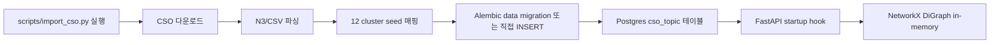

# CSO 임포트 워크플로

본 파일은 Computer Science Ontology (https://cso.kmi.open.ac.uk/) 데이터를 PostgreSQL의 `cso_topic` 테이블에 임포트하고 NetworkX 메모리 캐시로 로드하는 절차를 정의한다. 알고리즘 사용은 [`../algorithms/cso-mapping.md`](../algorithms/cso-mapping.md), 스키마는 [`schema.md`](schema.md).

## 임포트 단계



## 1. CSO 데이터 다운로드

CSO는 N3 (Notation3 RDF), TTL, CSV 포맷 제공. 1차는 CSV가 가장 다루기 쉽다.

| 파일 | URL | 비고 |
|---|---|---|
| `CSO.3.4.csv` | https://cso.kmi.open.ac.uk/downloads/CSO.3.4.csv | CSV 형식. <subject, predicate, object> triple |
| `CSO.3.4.nt` | https://cso.kmi.open.ac.uk/downloads/CSO.3.4.nt | RDF N-Triples 대안 |

`scripts/import_cso.py` 의사 코드:

```python
import csv
import httpx
from pathlib import Path

CSO_URL = "https://cso.kmi.open.ac.uk/downloads/CSO.3.4.csv"
CACHE_DIR = Path("./.cache/cso")

def download_cso():
    CACHE_DIR.mkdir(parents=True, exist_ok=True)
    target = CACHE_DIR / "CSO.3.4.csv"
    if target.exists():
        return target
    with httpx.stream("GET", CSO_URL, follow_redirects=True) as r:
        with open(target, "wb") as f:
            for chunk in r.iter_bytes():
                f.write(chunk)
    return target
```

## 2. 파싱

CSO 3.4.1 의 CSV 형식은 실제로는 **csv-quoted N-Triples** (각 라인이 `"<URI>","<P>","label"@en .` 형태). v13 round 3 (2026-05-16, R3-C03 fix) 에서 발견되어 parser 재작성.

우리가 사용하는 predicate:

- `<http://cso.kmi.open.ac.uk/schema/cso#superTopicOf>` — 부모/자식 관계
- `<http://cso.kmi.open.ac.uk/schema/cso#preferentialEquivalent>` — 정규 라벨
- `<http://www.w3.org/2000/01/rdf-schema#label>` — 라벨 텍스트
- `<http://www.w3.org/2002/07/owl#sameAs>` — 동등 관계 (1차는 무시)
- `<http://cso.kmi.open.ac.uk/schema/cso#relatedEquivalent>` — 동등 변형

```python
import re

PRED_SUPER = "http://cso.kmi.open.ac.uk/schema/cso#superTopicOf"
PRED_LABEL = "http://www.w3.org/2000/01/rdf-schema#label"
PRED_PREF  = "http://cso.kmi.open.ac.uk/schema/cso#preferentialEquivalent"
PRED_REL   = "http://cso.kmi.open.ac.uk/schema/cso#relatedEquivalent"

# csv-quoted N-Triples 토크나이저: <URI> 또는 "literal"@lang 또는 "literal"^^<type>
_TOKEN_RE = re.compile(r'<([^>]+)>|"((?:[^"\\]|\\.)*)"(?:@\w+|\^\^<[^>]+>)?')

def _strip_outer_csv_quote(line: str) -> str:
    """CSO 3.4.1 의 라인은 보통 `"<URI>","<P>","label"@en` 처럼 outer csv quote 로 감싸져 있다.
    csv.reader 가 outer quote 를 벗기되 내부 escape 처리는 별도 필요."""
    return line.strip()

def parse_cso_csv(path):
    topics: dict[str, dict] = {}     # uri -> {label, parent_uris[], equivalents[]}
    with path.open(encoding="utf-8") as f:
        for raw_line in f:
            line = _strip_outer_csv_quote(raw_line)
            if not line:
                continue
            tokens = _TOKEN_RE.findall(line)
            if len(tokens) < 3:
                continue
            # tokens: list[(uri_group, literal_group)] — uri 면 첫 그룹, literal 이면 둘째
            def _val(t): return t[0] if t[0] else t[1]
            s_uri, p_uri, o_val = _val(tokens[0]), _val(tokens[1]), _val(tokens[2])
            t = topics.setdefault(s_uri, {"label": None, "parent_uris": [], "equivalents": []})
            if p_uri == PRED_LABEL:
                t["label"] = o_val
            elif p_uri == PRED_SUPER:
                # superTopicOf: subject is parent, object is child
                child = topics.setdefault(o_val, {"label": None, "parent_uris": [], "equivalents": []})
                child["parent_uris"].append(s_uri)
            elif p_uri == PRED_REL:
                t["equivalents"].append(o_val)
            elif p_uri == PRED_PREF:
                ...
    return topics

def _norm_label(label: str) -> str:
    """CSO URI 의 snake_case label (`operating_systems`) 을 사람이 읽는 라벨 (`Operating Systems`) 로 정규화."""
    return label.replace("_", " ").strip()
```

## 3. 12 cluster seed 매핑 (BFS)

`algorithms/cso-mapping.md`의 12 seed 라벨을 URI로 변환 후 BFS. v13 round 3 (2026-05-16, R3-C03 fix) — CSO 3.4.1 에는 5 cluster 의 원래 seed 라벨이 없어 실제 존재하는 라벨로 교체.

```python
SEEDS = {
    "Artificial Intelligence": "AI",
    "Operating Systems": "Systems",                  # was "Computer Systems Organization" (CSO 3.4.1 부재)
    "Computer Hardware": "Hardware",
    "Automata Theory": "Theory",                     # was "Theory of Computation" (CSO 3.4.1 부재)
    "Software Engineering": "SE",
    "Computer Networks": "Networks",
    "Information Systems": "IS·DB",
    "Information Retrieval": "IR",
    "Computer Security": "Security",
    "Human-Computer Interaction": "HCI",
    "Interactive Computer Graphics": "Graphics·Multimedia",   # was "Computer Graphics" (CSO 3.4.1 부재)
    "Multimedia Systems": "Graphics·Multimedia",     # was "Multimedia" (CSO 3.4.1 부재)
    "Scientific Computing": "Computational Science", # was "Computational Science" (CSO 3.4.1 부재)
}

def assign_cluster_labels(topics):
    label_to_uri = {t["label"].lower(): uri for uri, t in topics.items() if t["label"]}
    seed_uris = {label_to_uri[k.lower()]: v for k, v in SEEDS.items() if k.lower() in label_to_uri}
    cluster_assignments: dict[str, set[str]] = defaultdict(set)
    # BFS from each seed: descendants get the cluster label
    for seed_uri, cluster_label in seed_uris.items():
        queue = [seed_uri]
        visited = set()
        while queue:
            current = queue.pop(0)
            if current in visited:
                continue
            visited.add(current)
            cluster_assignments[current].add(cluster_label)
            # 자식 = 자신을 부모로 가진 토픽
            for uri, t in topics.items():
                if current in t["parent_uris"]:
                    queue.append(uri)
    return cluster_assignments
```

## 4. INSERT (idempotent — A3 결정 4)

`scripts/import_cso.py` CLI 스크립트로 실행. **alembic data migration 대신 CLI 스크립트** (재실행·`--reset` 옵션 + httpx 다운로드 필요로 alembic 부적합). **idempotency**: `ON CONFLICT (uri) DO NOTHING` (cso_topic) + `ON CONFLICT DO NOTHING` (cso_topic_parent composite PK). `--reset` 플래그로 명시 TRUNCATE 후 재구성.

```python
from sqlalchemy.dialects.postgresql import insert as pg_insert
from app.db import AsyncSessionLocal
from app.db.models import CSOTopic, CSOTopicParent

async def insert_cso(topics, cluster_assignments):
    async with AsyncSessionLocal() as session:
        # 첫 패스: 라벨 + URI + cluster_labels — ON CONFLICT (uri) DO NOTHING
        uri_to_id: dict[str, UUID] = {}
        for uri, t in topics.items():
            stmt = pg_insert(CSOTopic).values(
                label=t["label"] or uri.split("/")[-1],
                uri=uri,
                parent_topic_id=None,
                cluster_labels=list(cluster_assignments.get(uri, [])),
            ).on_conflict_do_nothing(index_elements=["uri"]).returning(CSOTopic.cso_topic_id)
            result = await session.execute(stmt)
            row = result.fetchone()
            if row is None:
                # 이미 존재 — 기존 id 조회
                existing = await session.execute(select(CSOTopic.cso_topic_id).where(CSOTopic.uri == uri))
                uri_to_id[uri] = existing.scalar_one()
            else:
                uri_to_id[uri] = row.cso_topic_id

        # 두 번째 패스 (a): cso_topic.parent_topic_id 채움 — BFS 첫 부모 (deprecate 예정, backward-compat 만)
        # 두 번째 패스 (b): cso_topic_parent M:N — 모든 부모 INSERT (다중 부모 보존, NetworkX SOR)
        for uri, t in topics.items():
            if not t["parent_uris"]:
                continue
            # parent URI sort (결정성 보장)
            parent_uris = sorted(t["parent_uris"])
            primary = parent_uris[0]
            if primary in uri_to_id:
                await session.execute(
                    update(CSOTopic).where(CSOTopic.cso_topic_id == uri_to_id[uri])
                    .values(parent_topic_id=uri_to_id[primary])
                )
            # M:N: 모든 부모 ON CONFLICT DO NOTHING
            for p in parent_uris:
                if p not in uri_to_id:
                    continue
                stmt = pg_insert(CSOTopicParent).values(
                    cso_topic_id=uri_to_id[uri],
                    parent_cso_topic_id=uri_to_id[p],
                ).on_conflict_do_nothing()
                await session.execute(stmt)
        await session.commit()
```

## 5. NetworkX 캐시 빌드

서비스 시작 시 (`main.py` startup hook):

```python
import networkx as nx
from sqlalchemy import select

async def build_cso_graph(engine) -> nx.DiGraph:
    """NetworkX 그래프 빌드 — `cso_topic_parent` M:N SOR. `CSOTopic.parent_topic_id` 무시 (deprecate, A3 결정 18).
    `cso_topic_parent` 가 다중 부모를 자연 표현하므로 모든 부모 엣지가 보존된다.
    """
    g = nx.DiGraph()
    async with engine.connect() as conn:
        rows = await conn.execute(select(CSOTopic))
        for r in rows:
            g.add_node(
                r.cso_topic_id,
                label=r.label,
                uri=r.uri,
                cluster_labels=set(r.cluster_labels or []),
            )
        # parent edges — cso_topic_parent SOR (다중 부모 보존)
        rows2 = await conn.execute(select(CSOTopicParent))
        for r in rows2:
            # child --parent_of--> parent
            g.add_edge(r.cso_topic_id, r.parent_cso_topic_id, type="parent")
    return g

# topic 모듈 startup hook (backend/app/topic/lifespan.py)
app.state.cso_graph = await build_cso_graph(engine)
```

## 6. 검증

`algorithms/cso-mapping.md`의 임포트 무결성 룰:

```python
def verify_cso_import(g: nx.DiGraph):
    assert nx.is_directed_acyclic_graph(g), "CSO parent edges should be DAG"
    cluster_labels_seen = set()
    for n, data in g.nodes(data=True):
        cluster_labels_seen.update(data.get("cluster_labels", set()))
    expected = {"AI","Systems","Hardware","Theory","SE","Networks","IS·DB","IR","Security","HCI","Graphics·Multimedia","Computational Science"}
    assert expected <= cluster_labels_seen, f"missing clusters: {expected - cluster_labels_seen}"
    print(f"CSO graph nodes={g.number_of_nodes()} edges={g.number_of_edges()} clusters={len(cluster_labels_seen)}")
```

## 7. CLI 사용

```bash
# 1회 임포트 (개발)
make import-cso
# 또는
python -m scripts.import_cso --refresh

# 재임포트 (전체 삭제 후 재구성)
python -m scripts.import_cso --refresh --reset
```

## 8. 캐시 라이프사이클

`./.cache/cso/CSO.3.4.csv`는 다운로드 결과 영속. 같은 버전이면 재다운로드 안 함. CSO 버전이 갱신되면 (3.4 → 3.5) `--reset` 플래그로 재임포트.

<!-- TODO: A3가 CSO 3.4 vs 최신 버전 차이를 확인해 시드 안정 버전 핀 -->
