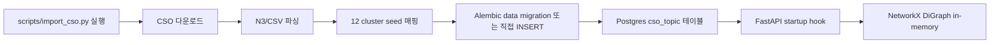

# CSO 임포트 워크플로

본 파일은 Computer Science Ontology (https://cso.kmi.open.ac.uk/) 데이터를 PostgreSQL의 `cso_topic` 테이블에 임포트하고 NetworkX 메모리 캐시로 로드하는 절차를 정의한다. 알고리즘 사용은 [`../algorithms/cso-mapping.md`](../algorithms/cso-mapping.md), 스키마는 [`schema.md`](schema.md).

## 임포트 단계



## 1. CSO 데이터 다운로드

CSO는 N3 (Notation3 RDF), TTL, CSV 포맷 제공. 1차는 CSV가 가장 다루기 쉽다.

| 파일 | URL | 비고 |
|---|---|---|
| `CSO.3.4.csv` | https://cso.kmi.open.ac.uk/downloads/CSO.3.4.csv | CSV 형식. <subject, predicate, object> triple |
| `CSO.3.4.nt` | https://cso.kmi.open.ac.uk/downloads/CSO.3.4.nt | RDF N-Triples 대안 |

`scripts/import_cso.py` 의사 코드:

```python
import csv
import httpx
from pathlib import Path

CSO_URL = "https://cso.kmi.open.ac.uk/downloads/CSO.3.4.csv"
CACHE_DIR = Path("./.cache/cso")

def download_cso():
    CACHE_DIR.mkdir(parents=True, exist_ok=True)
    target = CACHE_DIR / "CSO.3.4.csv"
    if target.exists():
        return target
    with httpx.stream("GET", CSO_URL, follow_redirects=True) as r:
        with open(target, "wb") as f:
            for chunk in r.iter_bytes():
                f.write(chunk)
    return target
```

## 2. 파싱

CSV의 각 행은 `<subject> <predicate> <object>` triple. 우리가 사용하는 predicate:

- `<http://cso.kmi.open.ac.uk/schema/cso#superTopicOf>` — 부모/자식 관계
- `<http://cso.kmi.open.ac.uk/schema/cso#preferentialEquivalent>` — 정규 라벨
- `<http://www.w3.org/2000/01/rdf-schema#label>` — 라벨 텍스트
- `<http://www.w3.org/2002/07/owl#sameAs>` — 동등 관계 (1차는 무시)
- `<http://cso.kmi.open.ac.uk/schema/cso#relatedEquivalent>` — 동등 변형

```python
PRED_SUPER = "<http://cso.kmi.open.ac.uk/schema/cso#superTopicOf>"
PRED_LABEL = "<http://www.w3.org/2000/01/rdf-schema#label>"
PRED_PREF  = "<http://cso.kmi.open.ac.uk/schema/cso#preferentialEquivalent>"
PRED_REL   = "<http://cso.kmi.open.ac.uk/schema/cso#relatedEquivalent>"

def parse_cso_csv(path):
    topics: dict[str, dict] = {}     # uri -> {label, parent_uris[], equivalents[]}
    with path.open() as f:
        reader = csv.reader(f)
        for s, p, o in reader:
            s_uri = strip_brackets(s)
            o_val = strip_brackets(o)
            t = topics.setdefault(s_uri, {"label": None, "parent_uris": [], "equivalents": []})
            if p == PRED_LABEL:
                t["label"] = unescape_literal(o_val)
            elif p == PRED_SUPER:
                # superTopicOf: subject is parent, object is child
                child = topics.setdefault(o_val, {"label": None, "parent_uris": [], "equivalents": []})
                child["parent_uris"].append(s_uri)
            elif p == PRED_REL:
                t["equivalents"].append(o_val)
            elif p == PRED_PREF:
                # 정규 라벨 매핑은 별도 dict
                ...
    return topics
```

## 3. 12 cluster seed 매핑 (BFS)

`algorithms/cso-mapping.md`의 12 seed 라벨을 URI로 변환 후 BFS:

```python
SEEDS = {
    "Artificial Intelligence": "AI",
    "Computer Systems Organization": "Systems",
    "Hardware": "Hardware",
    "Theory of Computation": "Theory",
    "Software Engineering": "SE",
    "Computer Networks": "Networks",
    "Information Systems": "IS·DB",
    "Information Retrieval": "IR",
    "Security and Privacy": "Security",
    "Human-Computer Interaction": "HCI",
    "Computer Graphics": "Graphics·Multimedia",
    "Multimedia": "Graphics·Multimedia",
    "Computational Science": "Computational Science",
}

def assign_cluster_labels(topics):
    label_to_uri = {t["label"].lower(): uri for uri, t in topics.items() if t["label"]}
    seed_uris = {label_to_uri[k.lower()]: v for k, v in SEEDS.items() if k.lower() in label_to_uri}
    cluster_assignments: dict[str, set[str]] = defaultdict(set)
    # BFS from each seed: descendants get the cluster label
    for seed_uri, cluster_label in seed_uris.items():
        queue = [seed_uri]
        visited = set()
        while queue:
            current = queue.pop(0)
            if current in visited:
                continue
            visited.add(current)
            cluster_assignments[current].add(cluster_label)
            # 자식 = 자신을 부모로 가진 토픽
            for uri, t in topics.items():
                if current in t["parent_uris"]:
                    queue.append(uri)
    return cluster_assignments
```

## 4. INSERT

Alembic data migration을 별도 작성하거나 (반복 가능), CLI 스크립트로 실행.

```python
from sqlalchemy import select
from app.db import async_session
from app.topic.models import CSOTopic

async def insert_cso(topics, cluster_assignments):
    async with async_session() as session:
        # 첫 패스: 라벨 + URI만 INSERT (parent FK는 두 번째 패스에서)
        uri_to_id = {}
        for uri, t in topics.items():
            row = CSOTopic(
                label=t["label"] or uri.split("/")[-1],
                uri=uri,
                parent_topic_id=None,
                cluster_labels=list(cluster_assignments.get(uri, [])),
            )
            session.add(row)
            await session.flush()
            uri_to_id[uri] = row.cso_topic_id

        # 두 번째 패스: parent FK 채우기
        for uri, t in topics.items():
            if t["parent_uris"]:
                # 여러 부모가 있을 수 있으나 우리는 1개만 보존 (BFS 순서로 첫 번째)
                first_parent = t["parent_uris"][0]
                if first_parent in uri_to_id:
                    await session.execute(
                        update(CSOTopic).where(CSOTopic.cso_topic_id == uri_to_id[uri])
                        .values(parent_topic_id=uri_to_id[first_parent])
                    )
        await session.commit()
```

## 5. NetworkX 캐시 빌드

서비스 시작 시 (`main.py` startup hook):

```python
import networkx as nx
from sqlalchemy import select

async def build_cso_graph(engine) -> nx.DiGraph:
    g = nx.DiGraph()
    async with engine.connect() as conn:
        rows = await conn.execute(select(CSOTopic))
        for r in rows:
            g.add_node(
                r.cso_topic_id,
                label=r.label,
                uri=r.uri,
                cluster_labels=set(r.cluster_labels or []),
            )
        # parent edges
        rows2 = await conn.execute(select(CSOTopic).where(CSOTopic.parent_topic_id.is_not(None)))
        for r in rows2:
            # child --parent_of--> parent
            g.add_edge(r.cso_topic_id, r.parent_topic_id, type="parent")
    return g

# main.py
app.state.cso_graph = await build_cso_graph(engine)
```

## 6. 검증

`algorithms/cso-mapping.md`의 임포트 무결성 룰:

```python
def verify_cso_import(g: nx.DiGraph):
    assert nx.is_directed_acyclic_graph(g), "CSO parent edges should be DAG"
    cluster_labels_seen = set()
    for n, data in g.nodes(data=True):
        cluster_labels_seen.update(data.get("cluster_labels", set()))
    expected = {"AI","Systems","Hardware","Theory","SE","Networks","IS·DB","IR","Security","HCI","Graphics·Multimedia","Computational Science"}
    assert expected <= cluster_labels_seen, f"missing clusters: {expected - cluster_labels_seen}"
    print(f"CSO graph nodes={g.number_of_nodes()} edges={g.number_of_edges()} clusters={len(cluster_labels_seen)}")
```

## 7. CLI 사용

```bash
# 1회 임포트 (개발)
make import-cso
# 또는
python -m scripts.import_cso --refresh

# 재임포트 (전체 삭제 후 재구성)
python -m scripts.import_cso --refresh --reset
```

## 8. 캐시 라이프사이클

`./.cache/cso/CSO.3.4.csv`는 다운로드 결과 영속. 같은 버전이면 재다운로드 안 함. CSO 버전이 갱신되면 (3.4 → 3.5) `--reset` 플래그로 재임포트.

<!-- TODO: A3가 CSO 3.4 vs 최신 버전 차이를 확인해 시드 안정 버전 핀 -->
