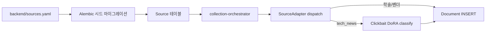

# 소스 레지스트리 (`sources.yaml`)

본 파일은 SKKU InSight의 수집 대상 소스 레지스트리 스키마와 초기 항목 골격을 정의한다. 결정 매트릭스 §5에 따라 학술 4종 + 빅테크 30+ + 테크 뉴스 6+ = 50–80개를 시드로 등록한다. 본 YAML은 Alembic seed로 Source 테이블에 INSERT한다.

## YAML 스키마

```yaml
# backend/sources.yaml
- name: <unique string>             # 표시용 이름
  source_type: academic | vendor_blog | tech_news
  url: <feed/api/landing URL>
  parser: arxiv | openalex | semantic_scholar | dblp | rss | naver_bs4
  cso_topic_tags: [<CSO label>, ...] # 사용자 토픽 매칭용 힌트
  language: ko | en | mixed
  trust_level: high | medium | low
  enabled: true | false
  extra:
    rate_limit_per_minute: <int>
    api_key_env: <env var name | null>
    crawl_selector: <CSS selector | null>   # naver_bs4 전용
    rss_alt_url: <URL | null>
```

`parser`는 `app/source_adapters/`의 어댑터 ID와 1:1 매핑한다.

## 학술 소스 (4종, source_type=academic, trust_level=high)

```yaml
- name: arXiv (cs.*)
  source_type: academic
  url: https://export.arxiv.org/api/query
  parser: arxiv
  cso_topic_tags: [Computer Science]   # 사용자별 카테고리 토픽으로 narrow
  language: en
  trust_level: high
  enabled: true
  extra:
    rate_limit_per_minute: 30           # arXiv API 권장
    categories: [cs.AI, cs.LG, cs.CV, cs.CL, cs.CR, cs.DB, cs.DC, cs.HC, cs.IR, cs.NE, cs.OS, cs.PL, cs.RO, cs.SE, cs.SY]

- name: OpenAlex
  source_type: academic
  url: https://api.openalex.org/works
  parser: openalex
  cso_topic_tags: []
  language: mixed
  trust_level: high
  enabled: true
  extra:
    rate_limit_per_minute: 100          # OpenAlex politeness pool
    polite_email_env: OPENALEX_POLITE_EMAIL

- name: Semantic Scholar
  source_type: academic
  url: https://api.semanticscholar.org/graph/v1/paper/search
  parser: semantic_scholar
  cso_topic_tags: []
  language: mixed
  trust_level: high
  enabled: true
  extra:
    rate_limit_per_minute: 60
    api_key_env: SEMANTIC_SCHOLAR_API_KEY    # 없으면 anonymous 호출, 더 낮은 RL

- name: DBLP
  source_type: academic
  url: https://dblp.org/search/publ/api
  parser: dblp
  cso_topic_tags: []
  language: mixed
  trust_level: high
  enabled: true
  extra:
    rate_limit_per_minute: 30
```

## 빅테크 공식 채널 (RSS, source_type=vendor_blog, trust_level=high)

```yaml
# 미국 / 글로벌
- name: Google Research Blog
  source_type: vendor_blog
  url: https://research.google/blog/rss/
  parser: rss
  cso_topic_tags: [Artificial Intelligence, Machine Learning, Computer Vision, Speech Recognition]
  language: en
  trust_level: high
  enabled: true
  extra: {}
  # TODO: verify URL  ← 일부 URL은 실제 검증 필요

- name: Google DeepMind Blog
  source_type: vendor_blog
  url: https://deepmind.google/blog/rss.xml
  parser: rss
  cso_topic_tags: [Artificial Intelligence, Reinforcement Learning]
  language: en
  trust_level: high
  enabled: true
  extra: {}
  # TODO: verify URL

- name: OpenAI Blog
  source_type: vendor_blog
  url: https://openai.com/blog/rss.xml
  parser: rss
  cso_topic_tags: [Artificial Intelligence, Natural Language Processing]
  language: en
  trust_level: high
  enabled: true
  extra: {}
  # TODO: verify URL

- name: Anthropic News
  source_type: vendor_blog
  url: https://www.anthropic.com/news/rss
  parser: rss
  cso_topic_tags: [Artificial Intelligence, AI Safety]
  language: en
  trust_level: high
  enabled: true
  extra: {}
  # TODO: verify URL

- name: Meta AI Blog
  source_type: vendor_blog
  url: https://ai.meta.com/blog/rss/
  parser: rss
  cso_topic_tags: [Artificial Intelligence, Computer Vision]
  language: en
  trust_level: high
  enabled: true
  extra: {}
  # TODO: verify URL

- name: Microsoft Research Blog
  source_type: vendor_blog
  url: https://www.microsoft.com/en-us/research/feed/
  parser: rss
  cso_topic_tags: [Artificial Intelligence, Software Engineering, Distributed Systems]
  language: en
  trust_level: high
  enabled: true
  extra: {}
  # TODO: verify URL

- name: NVIDIA Technical Blog
  source_type: vendor_blog
  url: https://developer.nvidia.com/blog/feed
  parser: rss
  cso_topic_tags: [GPU Computing, Deep Learning, Hardware]
  language: en
  trust_level: high
  enabled: true
  extra: {}
  # TODO: verify URL

- name: Apple Machine Learning Research
  source_type: vendor_blog
  url: https://machinelearning.apple.com/rss.xml
  parser: rss
  cso_topic_tags: [Machine Learning]
  language: en
  trust_level: high
  enabled: true
  extra: {}
  # TODO: verify URL

- name: IBM Research Blog
  source_type: vendor_blog
  url: https://research.ibm.com/blog/rss
  parser: rss
  cso_topic_tags: [Artificial Intelligence, Quantum Computing]
  language: en
  trust_level: high
  enabled: true
  extra: {}
  # TODO: verify URL

- name: Amazon Science
  source_type: vendor_blog
  url: https://www.amazon.science/blog.rss
  parser: rss
  cso_topic_tags: [Artificial Intelligence, Distributed Systems, Information Retrieval]
  language: en
  trust_level: high
  enabled: true
  extra: {}
  # TODO: verify URL

- name: Hugging Face Blog
  source_type: vendor_blog
  url: https://huggingface.co/blog/feed.xml
  parser: rss
  cso_topic_tags: [Natural Language Processing, Machine Learning]
  language: en
  trust_level: high
  enabled: true
  extra: {}
  # TODO: verify URL

- name: Cloudflare Blog
  source_type: vendor_blog
  url: https://blog.cloudflare.com/rss/
  parser: rss
  cso_topic_tags: [Computer Networks, Security and Privacy, Distributed Systems]
  language: en
  trust_level: high
  enabled: true
  extra: {}
  # TODO: verify URL

- name: Mistral AI News
  source_type: vendor_blog
  url: https://mistral.ai/feed.xml
  parser: rss
  cso_topic_tags: [Artificial Intelligence, Natural Language Processing]
  language: en
  trust_level: high
  enabled: true
  extra: {}
  # TODO: verify URL

- name: Cohere Blog
  source_type: vendor_blog
  url: https://cohere.com/blog/rss.xml
  parser: rss
  cso_topic_tags: [Natural Language Processing]
  language: en
  trust_level: high
  enabled: true
  extra: {}
  # TODO: verify URL

- name: Netflix Tech Blog
  source_type: vendor_blog
  url: https://netflixtechblog.com/feed
  parser: rss
  cso_topic_tags: [Distributed Systems, Software Engineering, Information Retrieval]
  language: en
  trust_level: high
  enabled: true
  extra: {}
  # TODO: verify URL

- name: Uber Engineering
  source_type: vendor_blog
  url: https://www.uber.com/blog/engineering/rss/
  parser: rss
  cso_topic_tags: [Distributed Systems, Software Engineering]
  language: en
  trust_level: high
  enabled: true
  extra: {}
  # TODO: verify URL

- name: LinkedIn Engineering
  source_type: vendor_blog
  url: https://engineering.linkedin.com/blog.rss.html
  parser: rss
  cso_topic_tags: [Distributed Systems, Information Retrieval]
  language: en
  trust_level: high
  enabled: true
  extra: {}
  # TODO: verify URL

- name: Spotify Engineering
  source_type: vendor_blog
  url: https://engineering.atspotify.com/feed/
  parser: rss
  cso_topic_tags: [Distributed Systems, Information Retrieval]
  language: en
  trust_level: high
  enabled: true
  extra: {}
  # TODO: verify URL

- name: Stripe Engineering Blog
  source_type: vendor_blog
  url: https://stripe.com/blog/engineering.rss
  parser: rss
  cso_topic_tags: [Distributed Systems, Security and Privacy]
  language: en
  trust_level: high
  enabled: true
  extra: {}
  # TODO: verify URL

# 한국 빅테크
- name: NAVER D2 (Tech)
  source_type: vendor_blog
  url: https://d2.naver.com/d2.atom
  parser: rss
  cso_topic_tags: [Software Engineering, Information Retrieval]
  language: ko
  trust_level: high
  enabled: true
  extra: {}
  # TODO: verify URL

- name: Kakao Tech
  source_type: vendor_blog
  url: https://tech.kakao.com/feed/
  parser: rss
  cso_topic_tags: [Software Engineering, Distributed Systems]
  language: ko
  trust_level: high
  enabled: true
  extra: {}
  # TODO: verify URL

- name: Samsung Research
  source_type: vendor_blog
  url: https://research.samsung.com/news/rss
  parser: rss
  cso_topic_tags: [Artificial Intelligence, Hardware]
  language: en
  trust_level: high
  enabled: true
  extra: {}
  # TODO: verify URL

- name: LG AI Research
  source_type: vendor_blog
  url: https://www.lgresearch.ai/blog/rss
  parser: rss
  cso_topic_tags: [Artificial Intelligence]
  language: en
  trust_level: high
  enabled: true
  extra: {}
  # TODO: verify URL

- name: Toss Tech
  source_type: vendor_blog
  url: https://toss.tech/rss.xml
  parser: rss
  cso_topic_tags: [Software Engineering, Distributed Systems]
  language: ko
  trust_level: high
  enabled: true
  extra: {}
  # TODO: verify URL

- name: 우아한형제들 기술블로그
  source_type: vendor_blog
  url: https://techblog.woowahan.com/feed/
  parser: rss
  cso_topic_tags: [Software Engineering, Distributed Systems]
  language: ko
  trust_level: high
  enabled: true
  extra: {}
  # TODO: verify URL

- name: LINE Engineering
  source_type: vendor_blog
  url: https://engineering.linecorp.com/en/feed/index
  parser: rss
  cso_topic_tags: [Software Engineering, Distributed Systems]
  language: mixed
  trust_level: high
  enabled: true
  extra: {}
  # TODO: verify URL

- name: NAVER Cloud Blog (AI)
  source_type: vendor_blog
  url: https://blog.naver.com/n_cloudplatform/rss
  parser: rss
  cso_topic_tags: [Cloud Computing, Artificial Intelligence]
  language: ko
  trust_level: medium
  enabled: false
  extra: {}
  # TODO: verify URL  # 일부 정책상 비활성으로 시작

- name: NCSOFT NLP Blog
  source_type: vendor_blog
  url: https://ncsoft.github.io/ncresearch/index.xml
  parser: rss
  cso_topic_tags: [Natural Language Processing]
  language: ko
  trust_level: medium
  enabled: false
  extra: {}
  # TODO: verify URL

# 추가 슬롯 (총 30+ 채우기) — 필요 시 A4가 보강
# - Pinterest Engineering, Slack Engineering, Dropbox Tech, GitHub Engineering, Cloudflare R2 Engineering, etc.
# TODO: A4가 추가 빅테크 RSS 30+ 까지 채워 50–80 범위 달성
```

## 테크 뉴스 (source_type=tech_news, 낚시성 필터 통과 필수, FR-25 / FR-30)

```yaml
- name: TechCrunch
  source_type: tech_news
  url: https://techcrunch.com/feed/
  parser: rss
  cso_topic_tags: [Artificial Intelligence, Software Engineering]
  language: en
  trust_level: medium
  enabled: true
  extra: {}

- name: The Verge — Tech
  source_type: tech_news
  url: https://www.theverge.com/rss/index.xml
  parser: rss
  cso_topic_tags: [Artificial Intelligence, Hardware, Software Engineering]
  language: en
  trust_level: medium
  enabled: true
  extra: {}

- name: WIRED — Tech
  source_type: tech_news
  url: https://www.wired.com/feed/category/business/latest/rss
  parser: rss
  cso_topic_tags: [Artificial Intelligence, Security and Privacy]
  language: en
  trust_level: medium
  enabled: true
  extra: {}

- name: MIT Technology Review
  source_type: tech_news
  url: https://www.technologyreview.com/feed/
  parser: rss
  cso_topic_tags: [Artificial Intelligence, Computer Science]
  language: en
  trust_level: medium
  enabled: true
  extra: {}

- name: IEEE Spectrum
  source_type: tech_news
  url: https://spectrum.ieee.org/feed
  parser: rss
  cso_topic_tags: [Hardware, Computer Science, Artificial Intelligence]
  language: en
  trust_level: medium
  enabled: true
  extra: {}

- name: 네이버뉴스 IT/과학
  source_type: tech_news
  url: https://news.naver.com/main/list.naver?mode=LSD&mid=sec&sid1=105
  parser: naver_bs4
  cso_topic_tags: [Artificial Intelligence, Software Engineering, Hardware]
  language: ko
  trust_level: low
  enabled: true
  extra:
    crawl_selector: "ul.type06_headline li, ul.type06 li"
    pagination_param: "page"
    max_pages: 3
  # 네이버뉴스는 토픽이 부모. 토픽 삭제 시 cascade.
```

## 적용 워크플로



## 운영 룰

- 새 소스 추가 시: 1) YAML 추가 2) Alembic data migration 작성 3) `parser` ID가 어댑터 dict에 등록되어 있는지 확인
- 비활성화: 관리자 콘솔의 `PATCH /admin/collection/sources/{id}` 또는 YAML에서 `enabled: false` 후 재시드
- URL 검증: `# TODO: verify URL` 마커가 있는 항목은 A4 단계에서 실제 RSS 피드 응답 확인 후 마커 제거 (그대로 작동하지 않을 수 있음)

<!-- TODO: A4가 50–80 범위까지 항목 보강. 본 골격은 30+ 항목 골자만 제공 -->
