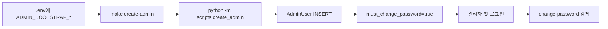

# 관리자 부트스트랩

본 파일은 첫 관리자 계정 생성과 강제 비밀번호 변경 절차를 정의한다. 결정 매트릭스 §2 "관리자 부트스트랩 = 환경변수 + CLI" 룰을 따른다. 관련 FR: FR-60. 관련 NFR: NFR-22.

## 절차



## 환경변수

| Var | 예시 |
|---|---|
| `ADMIN_BOOTSTRAP_EMAIL` | `admin@insight.test` |
| `ADMIN_BOOTSTRAP_PASSWORD` | `Bootstrap-Initial-2026-Strong!` (decision-backlog C-22 — 옛 default `Admin-Bootstrap-2026!` 은 정책 위반 — "admin" 금칙어 + email local part 포함) |
| `ADMIN_BOOTSTRAP_ROLE` | `super` |

`ADMIN_BOOTSTRAP_PASSWORD`는 [`../security/password-policy.md`](../security/password-policy.md) 룰을 만족해야 하며, lifespan validator 가 `change-this-to-*` 같은 placeholder 패턴도 차단한다 (C-22).

## CLI 스크립트

`backend/scripts/create_admin.py` — A2 실제 산출 (사용 패턴은 동일, 구현 변경):

```python
"""부트스트랩 또는 추가 관리자 생성.
사용:
    python -m scripts.create_admin                       # .env 의 ADMIN_BOOTSTRAP_* 사용
    python -m scripts.create_admin --email a@b.com --role operator   # 인자 우선
"""
import argparse
import asyncio
from datetime import UTC, datetime

from sqlalchemy import func, select

from app.config import get_settings
from app.contracts import AdminRole
from app.db.models import AdminUser
from app.db.session import AsyncSessionLocal
from app.security.password import (
    PolicyViolation,
    enforce_password_policy,
    hash_password,
)


async def _create(email: str, password: str, role: str) -> int:
    email_normalized = email.strip().lower()
    if role not in {r.value for r in AdminRole}:
        return 1
    try:
        enforce_password_policy(password, email=email_normalized)
    except PolicyViolation as exc:
        print(f"[FAIL] {exc.sub_code} — {exc.message}")
        return 1
    async with AsyncSessionLocal() as session:
        existing = await session.execute(
            select(AdminUser).where(func.lower(AdminUser.email) == email_normalized)
        )
        if existing.scalars().first() is not None:
            return 1
        admin = AdminUser(
            email=email_normalized,
            password_hash=hash_password(password),  # bcrypt 직접 + SHA-256 hex pre-hash (C-11)
            role=role,
            status="active",
            must_change_password=True,
            created_at=datetime.now(UTC),
        )
        session.add(admin)
        await session.commit()
    return 0


def main(argv: list[str] | None = None) -> int:
    settings = get_settings()
    parser = argparse.ArgumentParser()
    parser.add_argument("--email", default=settings.ADMIN_BOOTSTRAP_EMAIL)
    parser.add_argument("--password", default=settings.ADMIN_BOOTSTRAP_PASSWORD)
    parser.add_argument("--role", default=settings.ADMIN_BOOTSTRAP_ROLE.value,
                        choices=[r.value for r in AdminRole])
    args = parser.parse_args(argv)
    return asyncio.run(_create(args.email, args.password, args.role))
```

**구현 차이점** (decision-backlog C-11):
- `passlib.hash.bcrypt` 미사용 — passlib 1.7.4 가 bcrypt 4.x 와 호환 깨짐 (`__about__` 제거, 72-byte ValueError).
- `app.security.password.hash_password` 가 **bcrypt 직접 + SHA-256 hex pre-hash** (64 ASCII bytes — bcrypt 72-byte 한도 + null byte 회피, UTF-8 한국어 128자 정책 지원).
- email 은 lowercase + trim 정규화 (3겹 방어, C-7).

## Makefile 타깃

`Makefile`:

```makefile
create-admin:
	docker compose run --rm api python -m scripts.create_admin

create-operator:
	docker compose run --rm api python -m scripts.create_admin --role operator
```

## 첫 로그인 강제 비밀번호 변경 (server-side 가드, decision-backlog C-14)

1. 관리자 콘솔 (Next.js)에서 `ADMIN_BOOTSTRAP_EMAIL` + `ADMIN_BOOTSTRAP_PASSWORD` 로 로그인.
2. 응답에 `must_change_password=true`.
3. **server-side**: `get_current_admin` Depends 가 `must_change_password=true` admin 의 `/admin/*` 호출을 409 `admin.must_change_password` 로 차단. **예외 경로**: `/admin/auth/change-password` + `/admin/auth/logout` 두 endpoint 만 통과.
4. 클라이언트도 별도로 비밀번호 변경 모달을 즉시 표시 (사용성 — 다른 admin API 호출 시 받는 409 의존하지 않음).
5. `POST /admin/auth/change-password` 호출 → `must_change_password=false` UPDATE + 모든 admin refresh family revoke.

`POST /admin/auth/change-password` 본문:

```python
class ChangeAdminPasswordRequest(BaseModel):
    current_password: str
    new_password: str
```

`new_password` 도 password-policy 검증. 비번 변경 성공 시 모든 admin refresh 가 family revoke 되므로 재로그인 필요.

## 검증 체크리스트

- [ ] `make create-admin` 실행 시 AdminUser 1행 INSERT
- [ ] 동일 이메일 재실행 시 실패 (exit 1)
- [ ] role 미지정 시 super 기본
- [ ] 첫 로그인 응답에 `must_change_password=true`
- [ ] 변경 전 다른 admin API 호출 시 409 + `code=admin.must_change_password`
- [ ] 변경 후 정상 작동

## 운영 시 주의

- `.env`의 `ADMIN_BOOTSTRAP_PASSWORD`는 **반드시 첫 변경 후 의미 없는 값으로 교체** (또는 삭제).
- 추가 관리자 생성은 super가 admin-console UI를 통해 수행 (또는 CLI 재사용).
- 시연 후 `docker compose down -v`로 데이터를 지우면 부트스트랩을 다시 해야 한다.
