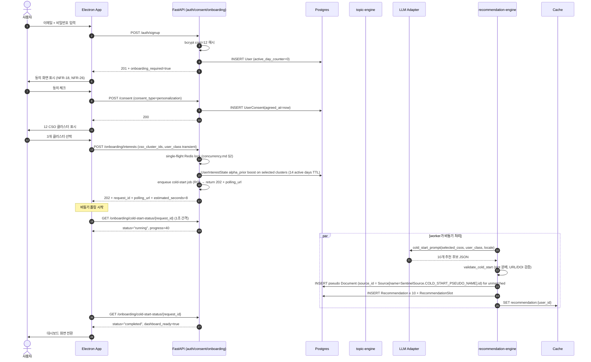
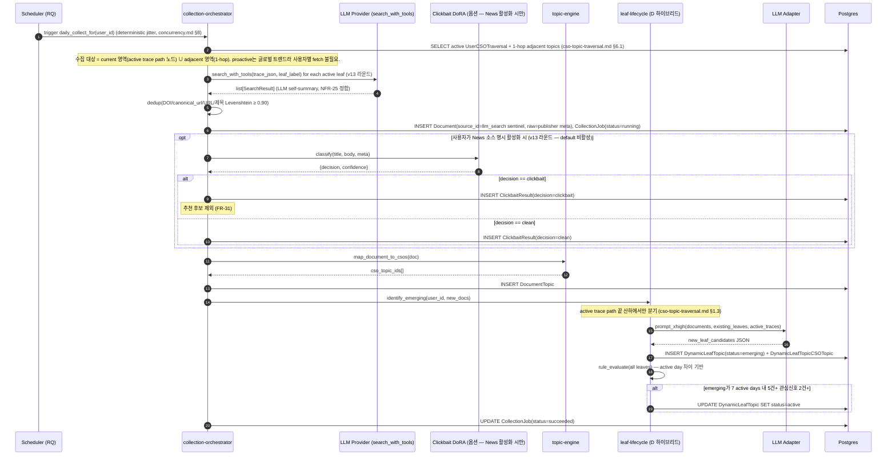
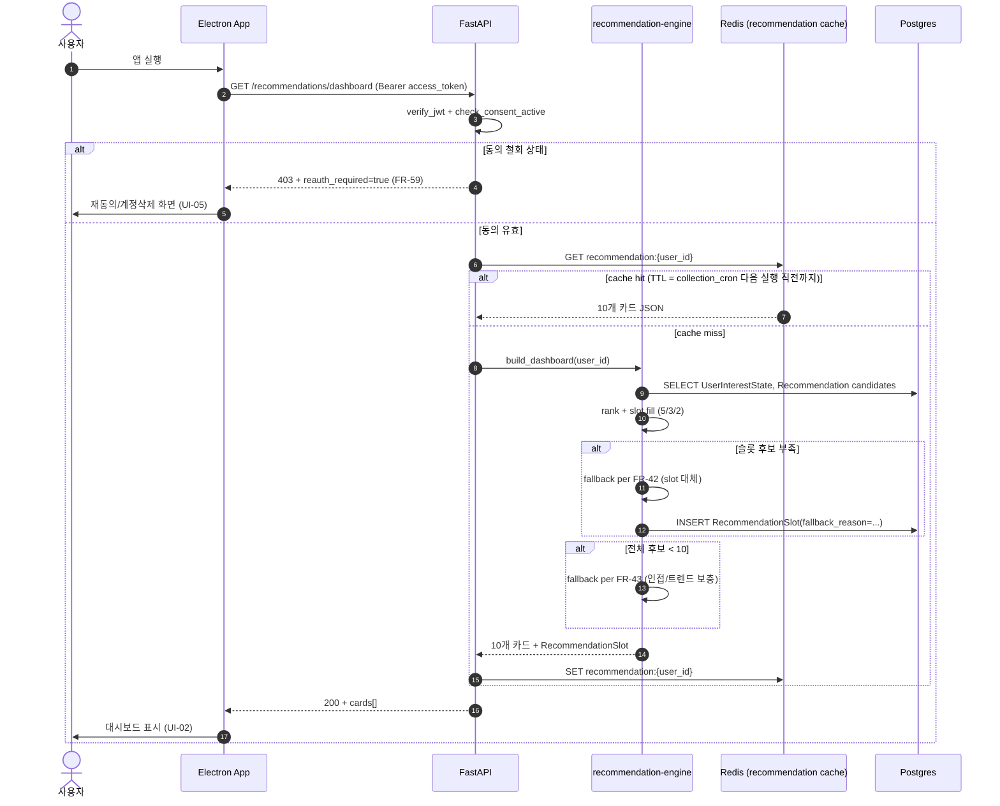
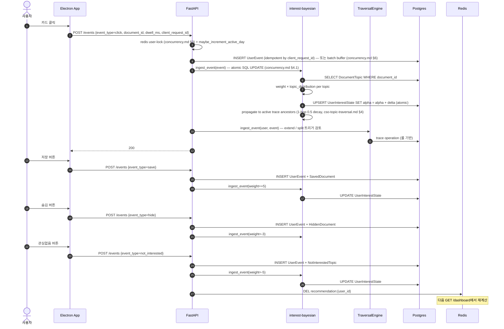
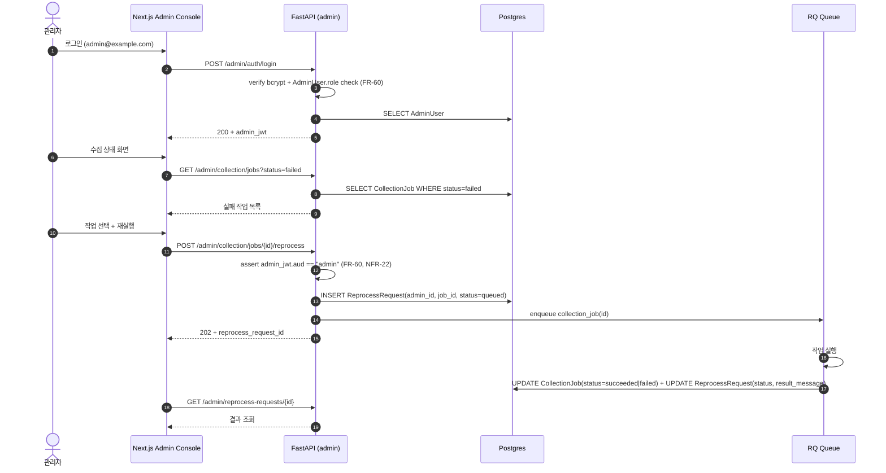

# 데이터 흐름 (시퀀스 다이어그램)

본 파일은 SKKU InSight 핵심 시나리오 5개의 시퀀스를 Mermaid로 정의한다. SRS §3.8 DFD의 시퀀스 보충본이다. 컴포넌트 책임은 [`architecture.md`](architecture.md), 모듈 인터페이스는 [`module-boundaries.md`](module-boundaries.md) 참고.

## 1. 신규 가입 → 온보딩 → 동의 → Cold-start (UC-01)

## 2. 일일 수집 잡 → 낚시성 필터 → 토픽 매핑 → emerging 식별 → active 승격 (UC-04 + FR-14·15)

## 3. 사용자 대시보드 조회 (UC-02)

## 4. 추천 카드 클릭·저장·숨김·관심없음 → 베이지안 업데이트 (UC-03 + FR-17·19·20)

## 5. 관리자 콘솔에서 실패 작업 재실행 (UC-05)

