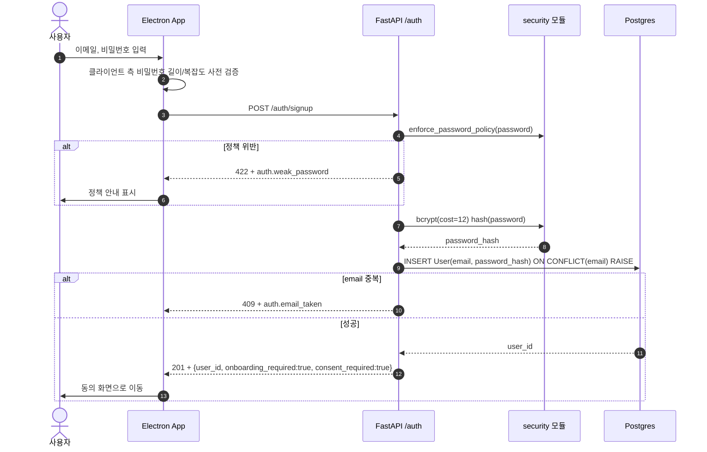
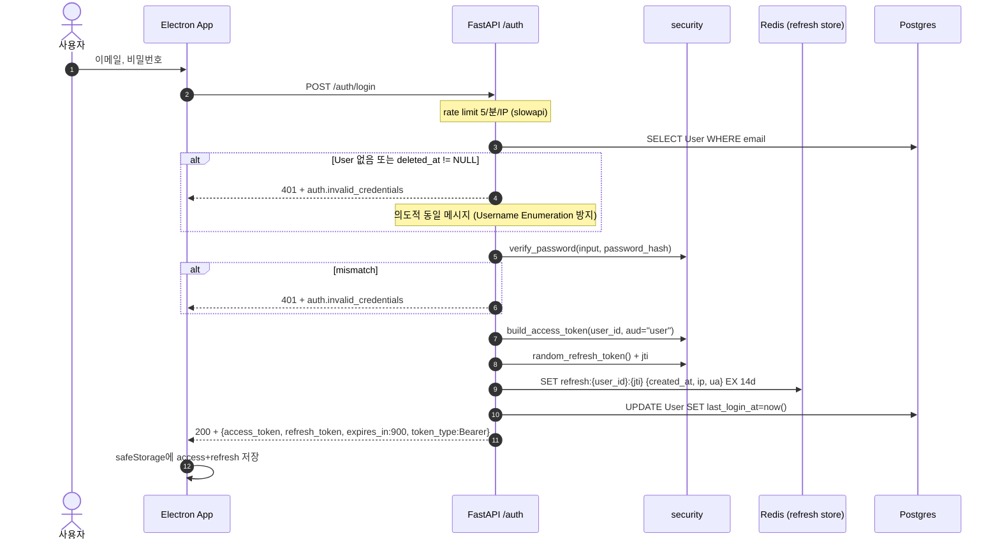
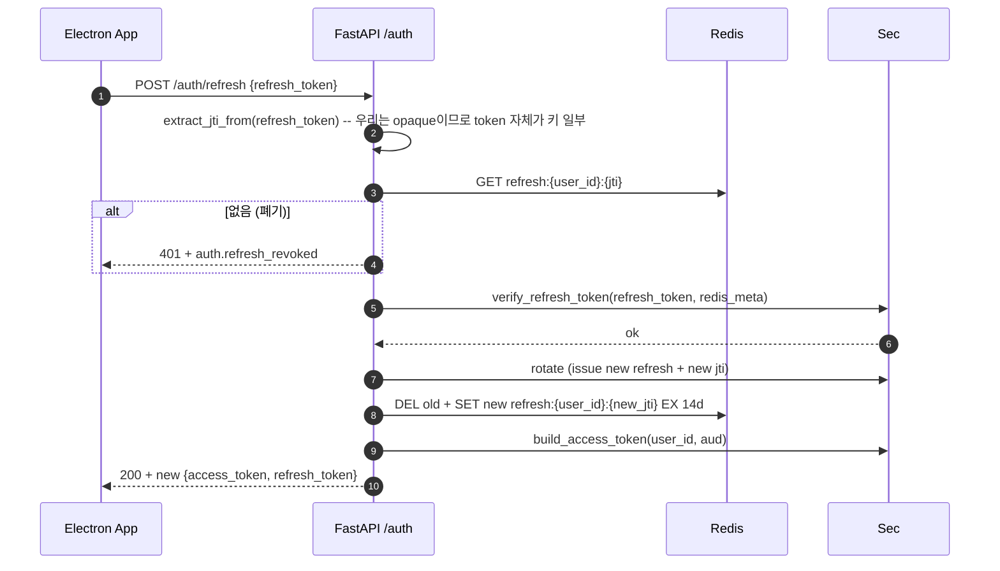
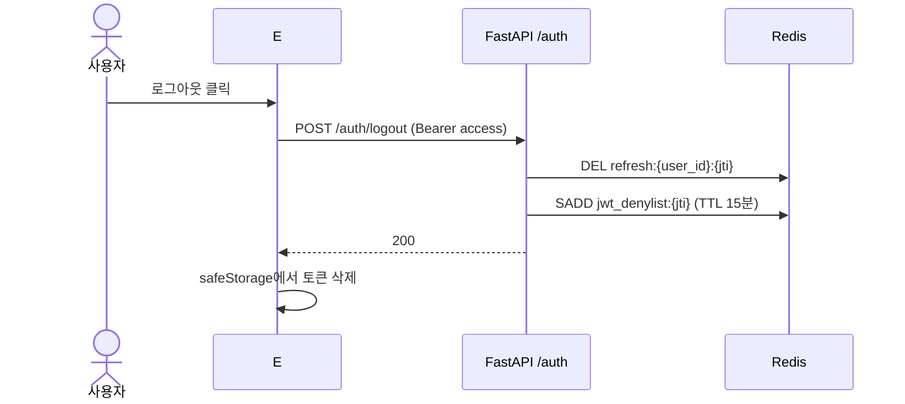
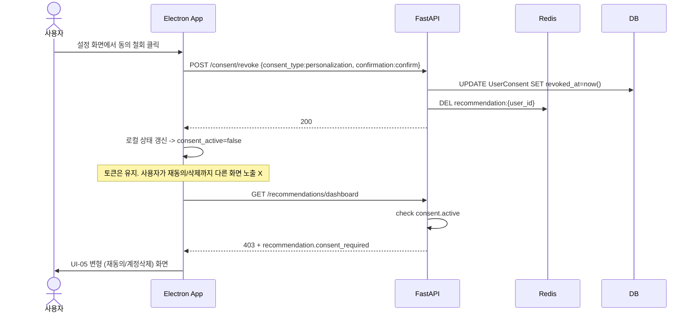

# 인증 흐름

본 파일은 SKKU InSight의 회원가입, 로그인, 토큰 갱신, 로그아웃, 동의 철회 플로우를 시퀀스 다이어그램으로 정의한다. 관련 FR: FR-01~04, FR-11. 관련 NFR: NFR-15~17, NFR-20. API 표는 [`../api/auth.md`](../api/auth.md), 토큰 처리는 [`token-handling.md`](token-handling.md), 비밀번호 정책은 [`password-policy.md`](password-policy.md).

## 결정 핀

- **bcrypt cost = 12** (passlib 기본값보다 높임 — NFR-16)
- **JWT Access**: 15분, HS256, 클레임 `{sub, aud, exp, iat, jti, iss}`
- **JWT Refresh**: opaque random 64바이트 token (서명 없음). Redis에 메타 저장 (`refresh:{user_id}:{jti} → {created_at, last_used_at, ip, ua}`)
- **Refresh 만료**: 14일
- **Electron 토큰 보관**: `safeStorage` (OS 키체인). 메모리에 평문 access만 유지

## 1. 회원가입



가입만으로는 로그인 토큰 미발급. 별도 `/auth/login` 호출 필요.

## 2. 로그인



## 3. 토큰 갱신



refresh rotation: 매 갱신마다 새 jti. 도난된 토큰을 한 번 사용하면 정상 사용자도 끊겨서 즉시 인지.

## 4. 로그아웃



전체 디바이스 로그아웃이 필요하면 `/auth/logout-all` (옵션) — `refresh:{user_id}:*` 패턴 일괄 삭제.

## 5. 동의 철회 → 인증과의 상호작용



## 인증 미들웨어 의사 코드

```python
async def auth_middleware(request, call_next):
    token = extract_bearer(request)
    if not token:
        return PlainTextResponse(status_code=401)
    try:
        payload = jwt.decode(token, JWT_SECRET, algorithms=["HS256"], audience=expected_aud(request))
    except ExpiredSignatureError:
        raise HTTPException(401, code="auth.token_expired")
    except JWTError:
        raise HTTPException(401, code="auth.invalid_token")
    if await redis.sismember(RedisKey.jwt_denylist(payload["jti"]), "1"):
        # ErrorCode.AUTH_INVALID_TOKEN — 폐기된 토큰은 invalid_token 으로 흡수 (재로그인 필요).
        raise HTTPException(401, code="auth.invalid_token")
    request.state.user_id = payload["sub"]
    request.state.aud = payload["aud"]
    return await call_next(request)
```

`/auth/*`와 `/health`는 미들웨어 우회 화이트리스트.

## 안전 권장

- **로그에 비밀번호/토큰 절대 미기록** — structlog processor로 마스킹
- **에러 메시지 통일** — Username enumeration 방지: 가입 시 `email_taken`을 줄 수밖에 없는데, 로그인 실패는 항상 `invalid_credentials`
- **HTTPS 강제** — 프록시 헤더 (`X-Forwarded-Proto`)로 검증, 비TLS 요청은 308 redirect
