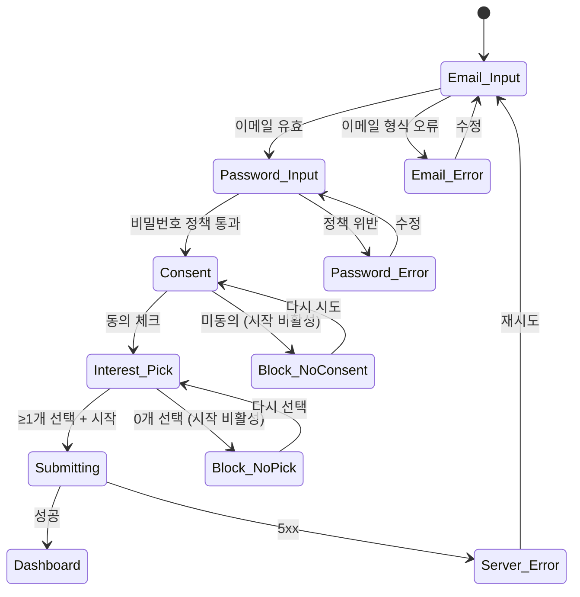
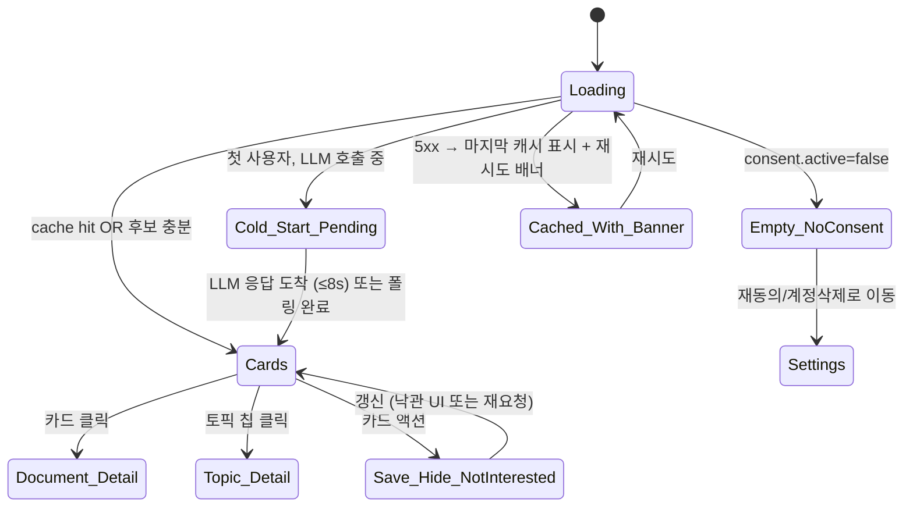
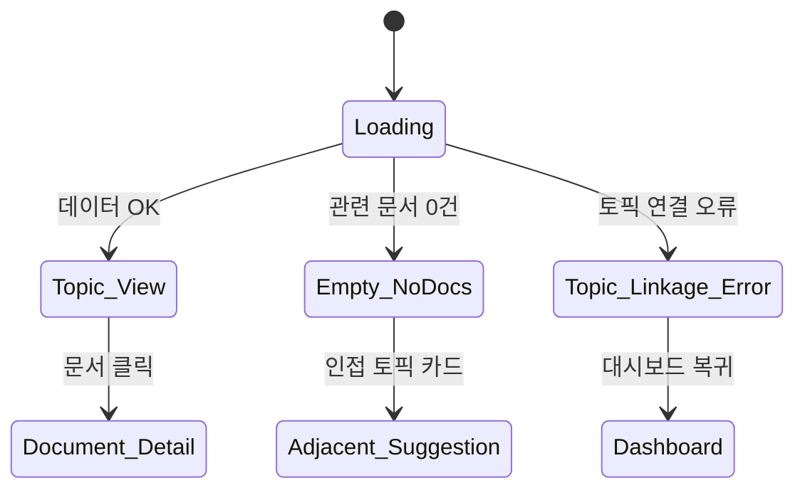
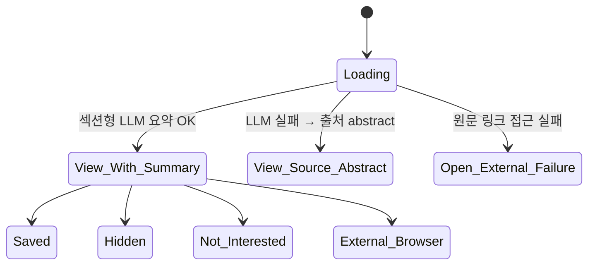
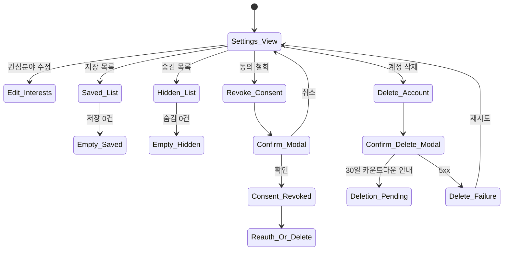
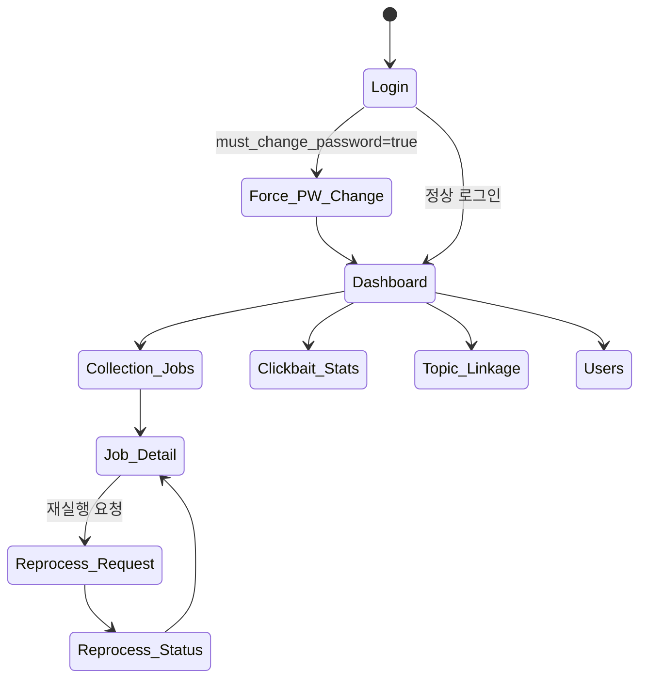
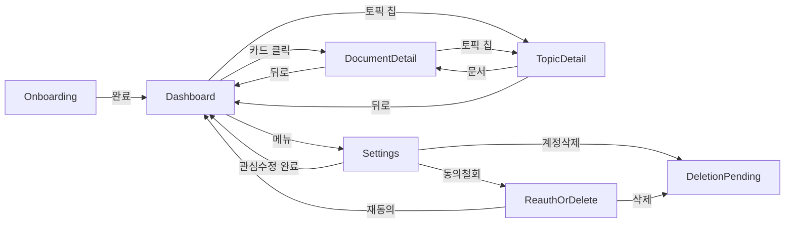

# 와이어프레임 인덱스와 화면별 상태 머신

본 파일은 SRS의 wire_01~06 PNG 6개를 인덱스하고, 각 화면의 정상/빈/오류 상태를 매트릭스로 정리한다. 원본 SRS UI 표는 [`../srs/02-functional-requirements.md`](../srs/02-functional-requirements.md). UI 상태 카탈로그는 [`ui-states.md`](ui-states.md). i18n 룰은 [`i18n.md`](i18n.md).

## 와이어프레임 인덱스 (Mermaid 단일 소스)

> 본 저장소에 `assets/wire_*.png` PNG 파일은 동봉되어 있지 않다. SRS 원본 docx의 와이어프레임 이미지에 의존하지 않고도 클라이언트 구현이 가능하도록, **본 파일의 화면별 상태 머신 Mermaid 다이어그램과 정상/빈/오류 상태 매트릭스가 단일 권위 소스**다. SRS 분할 파일의 PNG 마크다운 링크는 IEEE 830 원형 보존 목적만으로 유지된다.
>
> PNG가 향후 다시 합류해야 할 경우 (옵션):
> - SRS docx 압축 해제(`unzip SKKU_InSight_SRS.docx -d /tmp/srs-docx`)로 `word/media/` 추출
> - 또는 Figma·draw.io에서 신규 작도 후 `assets/`에 추가

| ID | 화면 | SRS UI | 본 파일 내 단일 소스 |
|---|---|---|---|
| wire_01 | 온보딩 | UI-01 | [§ UI-01 온보딩 화면](#ui-01-온보딩-화면) 의 Mermaid + 매트릭스 |
| wire_02 | 대시보드 | UI-02 | [§ UI-02 대시보드](#ui-02-대시보드) |
| wire_03 | 토픽 상세 | UI-03 | [§ UI-03 토픽 상세](#ui-03-토픽-상세) |
| wire_04 | 문서 상세 | UI-04 | [§ UI-04 문서 상세](#ui-04-문서-상세) |
| wire_05 | 설정/피드백 | UI-05 | [§ UI-05 설정피드백](#ui-05-설정피드백) |
| wire_06 | 관리자 웹 콘솔 | UI-06 | [§ UI-06 관리자 웹 콘솔](#ui-06-관리자-웹-콘솔) |

## 화면별 상태 머신

### UI-01 온보딩 화면

| 상태 | 정상 | 빈 | 오류 |
|---|---|---|---|
| Email_Input | 이메일 placeholder | (없음) | 이메일 형식 오류 안내 |
| Password_Input | 12자+ 인포 | (없음) | 정책 위반 (auth.weak_password.* 코드별 한국어 메시지) |
| Consent | 약관 + 체크 | (필수) | 미체크 시 시작 비활성 |
| Interest_Pick | 12 클러스터 카드 | 0개 선택 안내 | 서버 오류 시 재시도 안내 |
| Submitting | 스피너 | (없음) | 5xx → "잠시 후 다시 시도해주세요" |

### UI-02 대시보드

| 상태 | 정상 | 빈 | 오류 |
|---|---|---|---|
| Cards | 10개 카드 (5/3/2 또는 fallback 합쳐 10) | (10개 미달이면 fallback이 채움) | 카드 액션 실패 → 토스트 |
| Cold_Start_Pending | 스피너 + "맞춤 추천 준비 중" | | 8초 초과 → 폴링 안내 |
| Empty_NoConsent | UI-05 변형으로 redirect (consent.required) | | |
| Cached_With_Banner | 캐시된 카드 + "최신 데이터 가져오기 실패" 배너 | | 서버 회복 시 자동 재시도 |

### UI-03 토픽 상세

| 상태 | 정상 | 빈 | 오류 |
|---|---|---|---|
| Topic_View | 상위 토픽 + 리프 토픽 + 최신 문서 목록 | | |
| Empty_NoDocs | (없음) | "관련 최신 문서가 없습니다" + 인접 토픽 안내 | |
| Topic_Linkage_Error | (없음) | | "토픽 연결 오류가 발생했습니다" + 대시보드 복귀 버튼 |

### UI-04 문서 상세

| 상태 | 정상 | 빈 | 오류 |
|---|---|---|---|
| View_With_Summary | 4섹션 (핵심/배경/의의/한계) + reason_short | summary 미생성이면 source abstract | |
| View_Source_Abstract | (정상의 fallback) | | |
| Open_External_Failure | (없음) | | "원문 접근 실패" + 출처명 + 재시도 버튼 |

### UI-05 설정/피드백

| 상태 | 정상 | 빈 | 오류 |
|---|---|---|---|
| Saved_List | 저장 카드 목록 | "저장한 문서가 없습니다" | 5xx → 재시도 안내 |
| Hidden_List | 숨김 카드 목록 | "숨긴 문서가 없습니다" | 5xx → 재시도 |
| Revoke_Consent | 확인 모달 | | 5xx → 재시도 |
| Reauth_Or_Delete | 재동의 / 계정삭제 둘 중 선택 | (개인화 차단됨) | |
| Delete_Failure | (없음) | | "삭제 요청이 실패했습니다" + 재시도 + 고객 지원 |

### UI-06 관리자 웹 콘솔

| 상태 | 정상 | 빈 | 오류 |
|---|---|---|---|
| Force_PW_Change | 비밀번호 변경 모달 | | 정책 위반 시 한국어 안내 |
| Collection_Jobs | 잡 목록 + 필터 | "실패 작업이 없습니다 / 정상 운영 중" | 401 (admin role 부족) |
| Reprocess_Request | 사유 입력 + 확인 | | 409 (이미 큐잉됨) → 메시지 |
| Clickbait_Stats | 일별 차트 | "통계 데이터 없음" | |

## 화면 전환 다이어그램 (전체)

